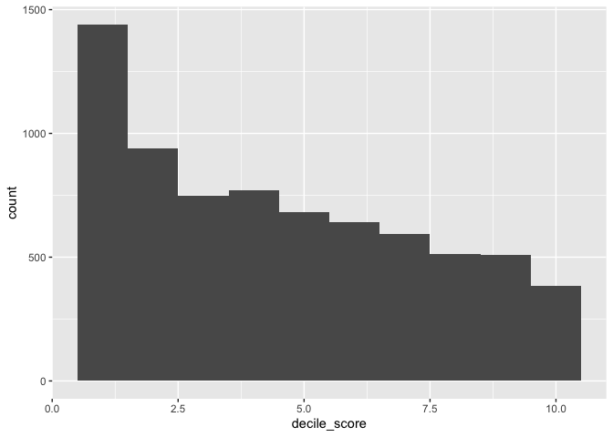
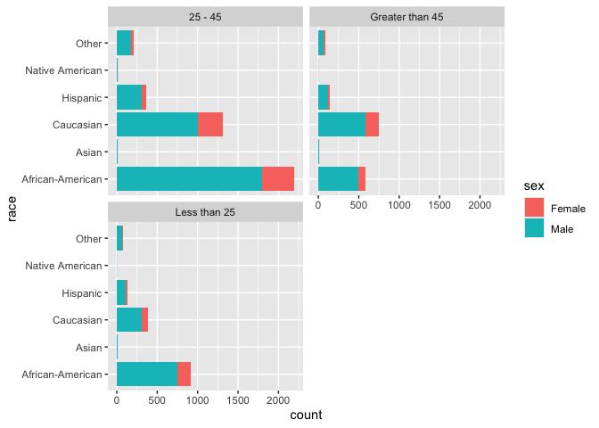
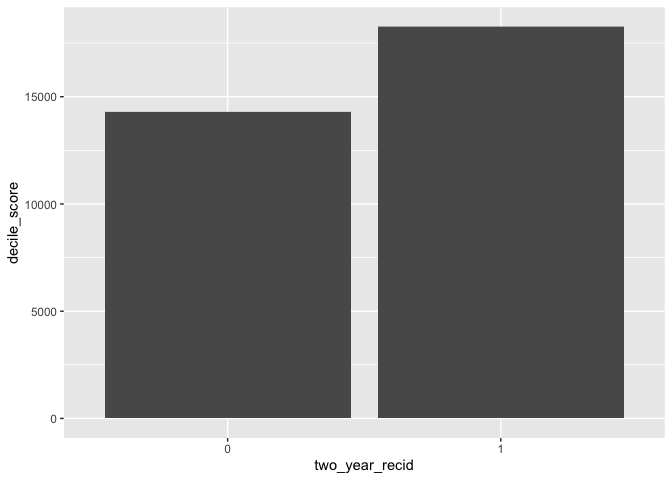
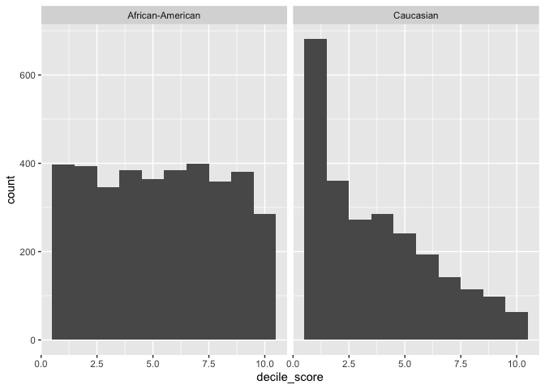
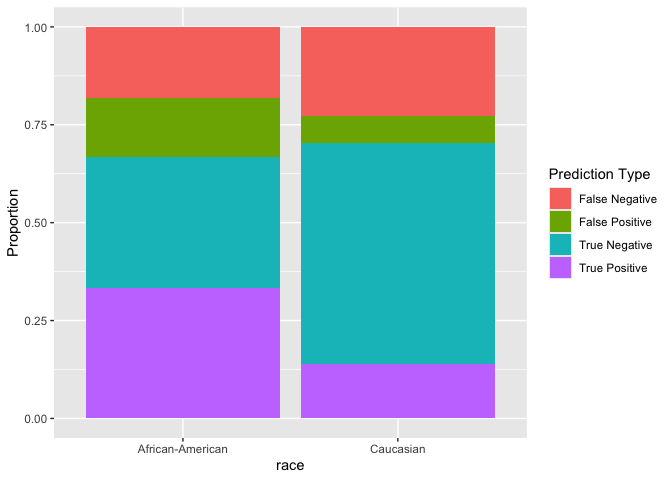
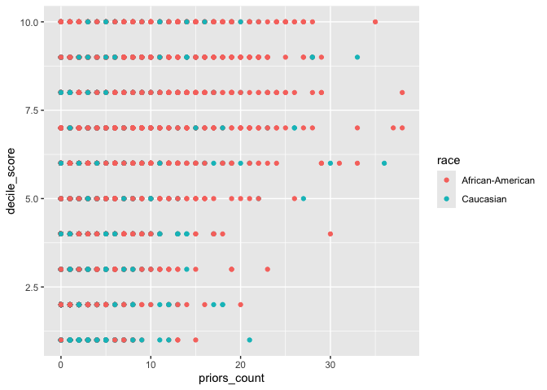

Lab 09: Algorithmic Bias
================
Thomas Huang
2026-03-26

## Load Packages and Data

First, let’s load the necessary packages:

``` r
library(tidyverse)
library(fairness)
library(janitor)
library(gmodels)
library(lmtest)
```

### The data

For this lab, we’ll use the COMPAS dataset compiled by ProPublica. The
data has been preprocessed and cleaned for you. You’ll have to load it
yourself. The dataset is available in the `data` folder, but I’ve
changed the file name from `compas-scores-two-years.csv` to
`compas-scores-2-years.csv`. I’ve done this help you practice debugging
code when you encounter an error.

``` r
compas <- read_csv("/Users/roberthuang/Desktop/Wake/Spring 2026/DSPsych/lab-09-ethics-algorithmic-bias/data/compas-scores-2-years.csv")
```

    ## New names:
    ## Rows: 7214 Columns: 53
    ## ── Column specification
    ## ──────────────────────────────────────────────────────── Delimiter: "," chr
    ## (19): name, first, last, sex, age_cat, race, c_case_number, c_charge_de... dbl
    ## (19): id, age, juv_fel_count, decile_score...12, juv_misd_count, juv_ot... lgl
    ## (1): violent_recid dttm (2): c_jail_in, c_jail_out date (12):
    ## compas_screening_date, dob, c_offense_date, c_arrest_date, r_offe...
    ## ℹ Use `spec()` to retrieve the full column specification for this data. ℹ
    ## Specify the column types or set `show_col_types = FALSE` to quiet this message.
    ## • `decile_score` -> `decile_score...12`
    ## • `priors_count` -> `priors_count...15`
    ## • `decile_score` -> `decile_score...40`
    ## • `priors_count` -> `priors_count...49`

# Part 1

``` r
# Load the COMPAS data
compas <- read_csv("data/compas-scores-2-years.csv") %>%
  clean_names() %>%
  rename(
    decile_score = decile_score_12,
    priors_count = priors_count_15
  )
```

    ## New names:
    ## Rows: 7214 Columns: 53
    ## ── Column specification
    ## ──────────────────────────────────────────────────────── Delimiter: "," chr
    ## (19): name, first, last, sex, age_cat, race, c_case_number, c_charge_de... dbl
    ## (19): id, age, juv_fel_count, decile_score...12, juv_misd_count, juv_ot... lgl
    ## (1): violent_recid dttm (2): c_jail_in, c_jail_out date (12):
    ## compas_screening_date, dob, c_offense_date, c_arrest_date, r_offe...
    ## ℹ Use `spec()` to retrieve the full column specification for this data. ℹ
    ## Specify the column types or set `show_col_types = FALSE` to quiet this message.
    ## • `decile_score` -> `decile_score...12`
    ## • `priors_count` -> `priors_count...15`
    ## • `decile_score` -> `decile_score...40`
    ## • `priors_count` -> `priors_count...49`

``` r
# Take a look at the data
glimpse(compas)
```

    ## Rows: 7,214
    ## Columns: 53
    ## $ id                      <dbl> 1, 3, 4, 5, 6, 7, 8, 9, 10, 13, 14, 15, 16, 18…
    ## $ name                    <chr> "miguel hernandez", "kevon dixon", "ed philo",…
    ## $ first                   <chr> "miguel", "kevon", "ed", "marcu", "bouthy", "m…
    ## $ last                    <chr> "hernandez", "dixon", "philo", "brown", "pierr…
    ## $ compas_screening_date   <date> 2013-08-14, 2013-01-27, 2013-04-14, 2013-01-1…
    ## $ sex                     <chr> "Male", "Male", "Male", "Male", "Male", "Male"…
    ## $ dob                     <date> 1947-04-18, 1982-01-22, 1991-05-14, 1993-01-2…
    ## $ age                     <dbl> 69, 34, 24, 23, 43, 44, 41, 43, 39, 21, 27, 23…
    ## $ age_cat                 <chr> "Greater than 45", "25 - 45", "Less than 25", …
    ## $ race                    <chr> "Other", "African-American", "African-American…
    ## $ juv_fel_count           <dbl> 0, 0, 0, 0, 0, 0, 0, 0, 0, 0, 0, 0, 0, 0, 0, 0…
    ## $ decile_score            <dbl> 1, 3, 4, 8, 1, 1, 6, 4, 1, 3, 4, 6, 1, 4, 1, 3…
    ## $ juv_misd_count          <dbl> 0, 0, 0, 1, 0, 0, 0, 0, 0, 0, 0, 0, 0, 0, 0, 0…
    ## $ juv_other_count         <dbl> 0, 0, 1, 0, 0, 0, 0, 0, 0, 0, 0, 0, 0, 0, 0, 0…
    ## $ priors_count            <dbl> 0, 0, 4, 1, 2, 0, 14, 3, 0, 1, 0, 3, 0, 0, 1, …
    ## $ days_b_screening_arrest <dbl> -1, -1, -1, NA, NA, 0, -1, -1, -1, 428, -1, 0,…
    ## $ c_jail_in               <dttm> 2013-08-13 06:03:42, 2013-01-26 03:45:27, 201…
    ## $ c_jail_out              <dttm> 2013-08-14 05:41:20, 2013-02-05 05:36:53, 201…
    ## $ c_case_number           <chr> "13011352CF10A", "13001275CF10A", "13005330CF1…
    ## $ c_offense_date          <date> 2013-08-13, 2013-01-26, 2013-04-13, 2013-01-1…
    ## $ c_arrest_date           <date> NA, NA, NA, NA, 2013-01-09, NA, NA, 2013-08-2…
    ## $ c_days_from_compas      <dbl> 1, 1, 1, 1, 76, 0, 1, 1, 1, 308, 1, 0, 0, 1, 4…
    ## $ c_charge_degree         <chr> "F", "F", "F", "F", "F", "M", "F", "F", "M", "…
    ## $ c_charge_desc           <chr> "Aggravated Assault w/Firearm", "Felony Batter…
    ## $ is_recid                <dbl> 0, 1, 1, 0, 0, 0, 1, 0, 0, 1, 0, 1, 0, 0, 1, 1…
    ## $ r_case_number           <chr> NA, "13009779CF10A", "13011511MM10A", NA, NA, …
    ## $ r_charge_degree         <chr> NA, "(F3)", "(M1)", NA, NA, NA, "(F2)", NA, NA…
    ## $ r_days_from_arrest      <dbl> NA, NA, 0, NA, NA, NA, 0, NA, NA, 0, NA, NA, N…
    ## $ r_offense_date          <date> NA, 2013-07-05, 2013-06-16, NA, NA, NA, 2014-…
    ## $ r_charge_desc           <chr> NA, "Felony Battery (Dom Strang)", "Driving Un…
    ## $ r_jail_in               <date> NA, NA, 2013-06-16, NA, NA, NA, 2014-03-31, N…
    ## $ r_jail_out              <date> NA, NA, 2013-06-16, NA, NA, NA, 2014-04-18, N…
    ## $ violent_recid           <lgl> NA, NA, NA, NA, NA, NA, NA, NA, NA, NA, NA, NA…
    ## $ is_violent_recid        <dbl> 0, 1, 0, 0, 0, 0, 0, 0, 0, 1, 0, 0, 0, 0, 0, 0…
    ## $ vr_case_number          <chr> NA, "13009779CF10A", NA, NA, NA, NA, NA, NA, N…
    ## $ vr_charge_degree        <chr> NA, "(F3)", NA, NA, NA, NA, NA, NA, NA, "(F2)"…
    ## $ vr_offense_date         <date> NA, 2013-07-05, NA, NA, NA, NA, NA, NA, NA, 2…
    ## $ vr_charge_desc          <chr> NA, "Felony Battery (Dom Strang)", NA, NA, NA,…
    ## $ type_of_assessment      <chr> "Risk of Recidivism", "Risk of Recidivism", "R…
    ## $ decile_score_40         <dbl> 1, 3, 4, 8, 1, 1, 6, 4, 1, 3, 4, 6, 1, 4, 1, 3…
    ## $ score_text              <chr> "Low", "Low", "Low", "High", "Low", "Low", "Me…
    ## $ screening_date          <date> 2013-08-14, 2013-01-27, 2013-04-14, 2013-01-1…
    ## $ v_type_of_assessment    <chr> "Risk of Violence", "Risk of Violence", "Risk …
    ## $ v_decile_score          <dbl> 1, 1, 3, 6, 1, 1, 2, 3, 1, 5, 4, 4, 1, 2, 1, 2…
    ## $ v_score_text            <chr> "Low", "Low", "Low", "Medium", "Low", "Low", "…
    ## $ v_screening_date        <date> 2013-08-14, 2013-01-27, 2013-04-14, 2013-01-1…
    ## $ in_custody              <date> 2014-07-07, 2013-01-26, 2013-06-16, NA, NA, 2…
    ## $ out_custody             <date> 2014-07-14, 2013-02-05, 2013-06-16, NA, NA, 2…
    ## $ priors_count_49         <dbl> 0, 0, 4, 1, 2, 0, 14, 3, 0, 1, 0, 3, 0, 0, 1, …
    ## $ start                   <dbl> 0, 9, 0, 0, 0, 1, 5, 0, 2, 0, 0, 4, 1, 0, 0, 0…
    ## $ end                     <dbl> 327, 159, 63, 1174, 1102, 853, 40, 265, 747, 4…
    ## $ event                   <dbl> 0, 1, 0, 0, 0, 0, 1, 0, 0, 1, 0, 1, 0, 0, 1, 1…
    ## $ two_year_recid          <dbl> 0, 1, 1, 0, 0, 0, 1, 0, 0, 1, 0, 1, 0, 0, 1, 1…

## Ex 1

``` r
nrow(compas) #There are 7,214 rows in the dataset, each of which represents a convinction.
```

    ## [1] 7214

``` r
ncol(compas) #There are 53 columns in the dataset.
```

    ## [1] 53

# Ex 2

``` r
n_distinct(compas$id) #By looking at the unique ids, there are 7,214 unique defendants in the dataset, which is the same as the number of rows. If not, a reason might be an individual having multiple convictions on the record.
```

    ## [1] 7214

# Ex 3

The distribution of risk scores is right skewed.

``` r
ggplot(compas, aes(x = decile_score)) +
  geom_histogram(binwidth = 1)
```

<!-- -->

## Ex 4

``` r
ggplot(compas, aes(x = race, fill = sex)) +
  geom_bar() +
  facet_wrap(~age_cat, ncol = 2) +
  coord_flip()
```

<!-- -->

# Part 2

## Ex 5

There seems to be a small difference where higher scores predict actual
recidivism. But more information is needed for inference.

``` r
compas <- compas %>% 
  mutate(two_year_recid = as.factor(two_year_recid))

ggplot(compas, aes(x = two_year_recid, y = decile_score)) +
  geom_col(binwidth = 1)
```

    ## Warning in geom_col(binwidth = 1): Ignoring unknown parameters: `binwidth`

<!-- -->

## Ex 6

``` r
compas <- compas %>% 
  mutate(compas_classification =
  case_when(
    decile_score >= 7 & two_year_recid == 1 ~ "TP",
    decile_score >= 7 & two_year_recid == 0 ~ "FP",
    decile_score <= 4 & two_year_recid == 1 ~ "FN",
    decile_score <= 4 & two_year_recid == 0 ~ "TN"
))
```

## Ex 7

68.4% of its predicitons are correct. This seems to be an okay
performance, above the by-change rate but not impressively high.,

``` r
prop.table(table(compas$compas_classification))
```

    ## 
    ##        FN        FP        TN        TP 
    ## 0.2063815 0.1093007 0.4550238 0.2292940

# Part 3

## Ex 8

The distribution of decile scores among white defendants is right
skewed, which means white defendants are lessly likely to get a higher
decile score. But black defendants have a similar chance of getting
lower or higher decile scores.

``` r
compas_r <- compas %>% 
  filter(race %in% c("African-American", "Caucasian"))

ggplot(compas_r, aes(x = decile_score, fill = race)) +
  geom_histogram(binwidth = 1)
```

<!-- -->

## Ex 9

A higher percentage of black defendants are classified as high risk than
that of white defendants.

``` r
compas_r <- compas_r%>% 
  mutate(high_risk =
  case_when(
    decile_score >= 7 ~ "TRUE",
    decile_score <= 4 ~ "FALSE"
))

CrossTable(table(compas_r$high_risk, compas_r$race),expected=T,prop.r=F,prop.c=T,prop.t=F,prop.chisq=F,chisq=T,fisher=T,format="SPSS")
```

    ## 
    ##    Cell Contents
    ## |-------------------------|
    ## |                   Count |
    ## |         Expected Values |
    ## |          Column Percent |
    ## |-------------------------|
    ## 
    ## Total Observations in Table:  4966 
    ## 
    ##              |  
    ##              | African-American  |        Caucasian  |        Row Total | 
    ## -------------|------------------|------------------|------------------|
    ##        FALSE |            1522  |            1600  |            3122  | 
    ##              |        1852.705  |        1269.295  |                  | 
    ##              |          51.646% |          79.247% |                  | 
    ## -------------|------------------|------------------|------------------|
    ##         TRUE |            1425  |             419  |            1844  | 
    ##              |        1094.295  |         749.705  |                  | 
    ##              |          48.354% |          20.753% |                  | 
    ## -------------|------------------|------------------|------------------|
    ## Column Total |            2947  |            2019  |            4966  | 
    ##              |          59.344% |          40.656% |                  | 
    ## -------------|------------------|------------------|------------------|
    ## 
    ##  
    ## Statistics for All Table Factors
    ## 
    ## 
    ## Pearson's Chi-squared test 
    ## ------------------------------------------------------------
    ## Chi^2 =  391.0136     d.f. =  1     p =  4.97974e-87 
    ## 
    ## Pearson's Chi-squared test with Yates' continuity correction 
    ## ------------------------------------------------------------
    ## Chi^2 =  389.8322     d.f. =  1     p =  9.00354e-87 
    ## 
    ##  
    ## Fisher's Exact Test for Count Data
    ## ------------------------------------------------------------
    ## Sample estimate odds ratio:  0.2797732 
    ## 
    ## Alternative hypothesis: true odds ratio is not equal to 1
    ## p =  1.843073e-90 
    ## 95% confidence interval:  0.2450988 0.3189669 
    ## 
    ## Alternative hypothesis: true odds ratio is less than 1
    ## p =  1.278519e-90 
    ## 95% confidence interval:  0 0.3124856 
    ## 
    ## Alternative hypothesis: true odds ratio is greater than 1
    ## p =  1 
    ## 95% confidence interval:  0.2503133 Inf 
    ## 
    ## 
    ##  
    ##        Minimum expected frequency: 749.7052

## Ex 10

False positive rate of black defendants: 31.11%. False positive rate of
white defendants: 10.67%.

False negative rate of black defendants: 35.23%. False negative rate of
white defendants: 61.96%.

``` r
# False positive
non_recidivists <- compas_r %>%
  filter(two_year_recid == 0)

CrossTable(table(non_recidivists$high_risk, non_recidivists$race),expected=T,prop.r=F,prop.c=T,prop.t=F,prop.chisq=F,chisq=T,fisher=T,format="SPSS")
```

    ## 
    ##    Cell Contents
    ## |-------------------------|
    ## |                   Count |
    ## |         Expected Values |
    ## |          Column Percent |
    ## |-------------------------|
    ## 
    ## Total Observations in Table:  2712 
    ## 
    ##              |  
    ##              | African-American  |        Caucasian  |        Row Total | 
    ## -------------|------------------|------------------|------------------|
    ##        FALSE |             990  |            1139  |            2129  | 
    ##              |        1128.087  |        1000.913  |                  | 
    ##              |          68.894% |          89.333% |                  | 
    ## -------------|------------------|------------------|------------------|
    ##         TRUE |             447  |             136  |             583  | 
    ##              |         308.913  |         274.087  |                  | 
    ##              |          31.106% |          10.667% |                  | 
    ## -------------|------------------|------------------|------------------|
    ## Column Total |            1437  |            1275  |            2712  | 
    ##              |          52.987% |          47.013% |                  | 
    ## -------------|------------------|------------------|------------------|
    ## 
    ##  
    ## Statistics for All Table Factors
    ## 
    ## 
    ## Pearson's Chi-squared test 
    ## ------------------------------------------------------------
    ## Chi^2 =  167.2499     d.f. =  1     p =  2.950115e-38 
    ## 
    ## Pearson's Chi-squared test with Yates' continuity correction 
    ## ------------------------------------------------------------
    ## Chi^2 =  166.0409     d.f. =  1     p =  5.419088e-38 
    ## 
    ##  
    ## Fisher's Exact Test for Count Data
    ## ------------------------------------------------------------
    ## Sample estimate odds ratio:  0.2645761 
    ## 
    ## Alternative hypothesis: true odds ratio is not equal to 1
    ## p =  6.17536e-40 
    ## 95% confidence interval:  0.2127355 0.3275084 
    ## 
    ## Alternative hypothesis: true odds ratio is less than 1
    ## p =  4.451581e-40 
    ## 95% confidence interval:  0 0.3169062 
    ## 
    ## Alternative hypothesis: true odds ratio is greater than 1
    ## p =  1 
    ## 95% confidence interval:  0.2202699 Inf 
    ## 
    ## 
    ##  
    ##        Minimum expected frequency: 274.0874

``` r
# False negative
recidivists <- compas_r %>%
  filter(two_year_recid == 1)

CrossTable(table(recidivists$high_risk, recidivists$race),expected=T,prop.r=F,prop.c=T,prop.t=F,prop.chisq=F,chisq=T,fisher=T,format="SPSS")
```

    ## 
    ##    Cell Contents
    ## |-------------------------|
    ## |                   Count |
    ## |         Expected Values |
    ## |          Column Percent |
    ## |-------------------------|
    ## 
    ## Total Observations in Table:  2254 
    ## 
    ##              |  
    ##              | African-American  |        Caucasian  |        Row Total | 
    ## -------------|------------------|------------------|------------------|
    ##        FALSE |             532  |             461  |             993  | 
    ##              |         665.231  |         327.769  |                  | 
    ##              |          35.232% |          61.962% |                  | 
    ## -------------|------------------|------------------|------------------|
    ##         TRUE |             978  |             283  |            1261  | 
    ##              |         844.769  |         416.231  |                  | 
    ##              |          64.768% |          38.038% |                  | 
    ## -------------|------------------|------------------|------------------|
    ## Column Total |            1510  |             744  |            2254  | 
    ##              |          66.992% |          33.008% |                  | 
    ## -------------|------------------|------------------|------------------|
    ## 
    ##  
    ## Statistics for All Table Factors
    ## 
    ## 
    ## Pearson's Chi-squared test 
    ## ------------------------------------------------------------
    ## Chi^2 =  144.4961     d.f. =  1     p =  2.767745e-33 
    ## 
    ## Pearson's Chi-squared test with Yates' continuity correction 
    ## ------------------------------------------------------------
    ## Chi^2 =  143.4136     d.f. =  1     p =  4.773131e-33 
    ## 
    ##  
    ## Fisher's Exact Test for Count Data
    ## ------------------------------------------------------------
    ## Sample estimate odds ratio:  0.3341116 
    ## 
    ## Alternative hypothesis: true odds ratio is not equal to 1
    ## p =  3.186e-33 
    ## 95% confidence interval:  0.2772169 0.4021543 
    ## 
    ## Alternative hypothesis: true odds ratio is less than 1
    ## p =  2.084246e-33 
    ## 95% confidence interval:  0 0.3906685 
    ## 
    ## Alternative hypothesis: true odds ratio is greater than 1
    ## p =  1 
    ## 95% confidence interval:  0.2854984 Inf 
    ## 
    ## 
    ##  
    ##        Minimum expected frequency: 327.7693

## Ex 11

The overall accuracy among black defendants is lower. There’s a higher
false positive rate among black defendants and a higher false negative
rate among white defendants.

``` r
compas_r %>% 
  filter(!is.na(compas_classification)) %>% 
  ggplot(aes(x = race, fill = compas_classification)) +
  geom_bar(position = "fill") +
  labs(
    fill = "Prediction Type",
    y = "Proportion"
  )+
  scale_fill_discrete(
  labels = c("TP" = "True Positive",
             "FP" = "False Positive",
             "FN" = "False Negative",
             "TN" = "True Negative")
)
```

<!-- -->

# Part 4

## Ex 12

The algorithm assigns a much heavier weight on prior convictions among
black defendants.

``` r
ggplot(compas_r, aes(x = priors_count, y = decile_score, color = race)) +
  geom_point()
```

<!-- -->

## Ex 13

I first regressed the two-year recidivation on the risk score (model 1),
and then added race (model 2) and the interaction term of race and the
risk score (model 3). Across three models, the risk score is a
significant predictor of the two-year recidivation. Race and the
interaction term are not significant predictors of the outcome. Results
of likelihood ratio tests indicate the three models have similar model
fit. Therefore, the risk score predicts two-year recidivation in a
similar way among black and white defendants. In other words, there is
not enough evidence to show the relationship between the risk score and
two-year recidivation is related to the race of defendants. From this
perspective, Northpointe’s claim that the algorithm is fair seems to be
supported by the results

``` r
model1 <- glm(two_year_recid ~ decile_score, data = compas_r, family = binomial)
summary(model1)
```

    ## 
    ## Call:
    ## glm(formula = two_year_recid ~ decile_score, family = binomial, 
    ##     data = compas_r)
    ## 
    ## Coefficients:
    ##              Estimate Std. Error z value Pr(>|z|)    
    ## (Intercept)  -1.40424    0.05522  -25.43   <2e-16 ***
    ## decile_score  0.26686    0.01008   26.47   <2e-16 ***
    ## ---
    ## Signif. codes:  0 '***' 0.001 '**' 0.01 '*' 0.05 '.' 0.1 ' ' 1
    ## 
    ## (Dispersion parameter for binomial family taken to be 1)
    ## 
    ##     Null deviance: 8497.5  on 6149  degrees of freedom
    ## Residual deviance: 7707.3  on 6148  degrees of freedom
    ## AIC: 7711.3
    ## 
    ## Number of Fisher Scoring iterations: 4

``` r
model2 <- glm(two_year_recid ~ decile_score + race, data = compas_r, family = binomial)
summary(model2)
```

    ## 
    ## Call:
    ## glm(formula = two_year_recid ~ decile_score + race, family = binomial, 
    ##     data = compas_r)
    ## 
    ## Coefficients:
    ##               Estimate Std. Error z value Pr(>|z|)    
    ## (Intercept)   -1.34206    0.06547 -20.498   <2e-16 ***
    ## decile_score   0.26216    0.01042  25.163   <2e-16 ***
    ## raceCaucasian -0.10107    0.05780  -1.749   0.0803 .  
    ## ---
    ## Signif. codes:  0 '***' 0.001 '**' 0.01 '*' 0.05 '.' 0.1 ' ' 1
    ## 
    ## (Dispersion parameter for binomial family taken to be 1)
    ## 
    ##     Null deviance: 8497.5  on 6149  degrees of freedom
    ## Residual deviance: 7704.3  on 6147  degrees of freedom
    ## AIC: 7710.3
    ## 
    ## Number of Fisher Scoring iterations: 4

``` r
model3 <- glm(two_year_recid ~ decile_score + race + decile_score*race, data = compas_r, family = binomial)
summary(model3)
```

    ## 
    ## Call:
    ## glm(formula = two_year_recid ~ decile_score + race + decile_score * 
    ##     race, family = binomial, data = compas_r)
    ## 
    ## Coefficients:
    ##                            Estimate Std. Error z value Pr(>|z|)    
    ## (Intercept)                -1.29698    0.07717 -16.806   <2e-16 ***
    ## decile_score                0.25367    0.01296  19.572   <2e-16 ***
    ## raceCaucasian              -0.20569    0.11217  -1.834   0.0667 .  
    ## decile_score:raceCaucasian  0.02370    0.02178   1.088   0.2767    
    ## ---
    ## Signif. codes:  0 '***' 0.001 '**' 0.01 '*' 0.05 '.' 0.1 ' ' 1
    ## 
    ## (Dispersion parameter for binomial family taken to be 1)
    ## 
    ##     Null deviance: 8497.5  on 6149  degrees of freedom
    ## Residual deviance: 7703.1  on 6146  degrees of freedom
    ## AIC: 7711.1
    ## 
    ## Number of Fisher Scoring iterations: 4

``` r
lrtest(model1, model2)
```

    ## Likelihood ratio test
    ## 
    ## Model 1: two_year_recid ~ decile_score
    ## Model 2: two_year_recid ~ decile_score + race
    ##   #Df  LogLik Df  Chisq Pr(>Chisq)  
    ## 1   2 -3853.7                       
    ## 2   3 -3852.1  1 3.0533    0.08057 .
    ## ---
    ## Signif. codes:  0 '***' 0.001 '**' 0.01 '*' 0.05 '.' 0.1 ' ' 1

``` r
lrtest(model2, model3)
```

    ## Likelihood ratio test
    ## 
    ## Model 1: two_year_recid ~ decile_score + race
    ## Model 2: two_year_recid ~ decile_score + race + decile_score * race
    ##   #Df  LogLik Df  Chisq Pr(>Chisq)
    ## 1   3 -3852.1                     
    ## 2   4 -3851.6  1 1.1876     0.2758

``` r
lrtest(model1, model3)
```

    ## Likelihood ratio test
    ## 
    ## Model 1: two_year_recid ~ decile_score
    ## Model 2: two_year_recid ~ decile_score + race + decile_score * race
    ##   #Df  LogLik Df  Chisq Pr(>Chisq)
    ## 1   2 -3853.7                     
    ## 2   4 -3851.6  2 4.2409       0.12

# Part 5
